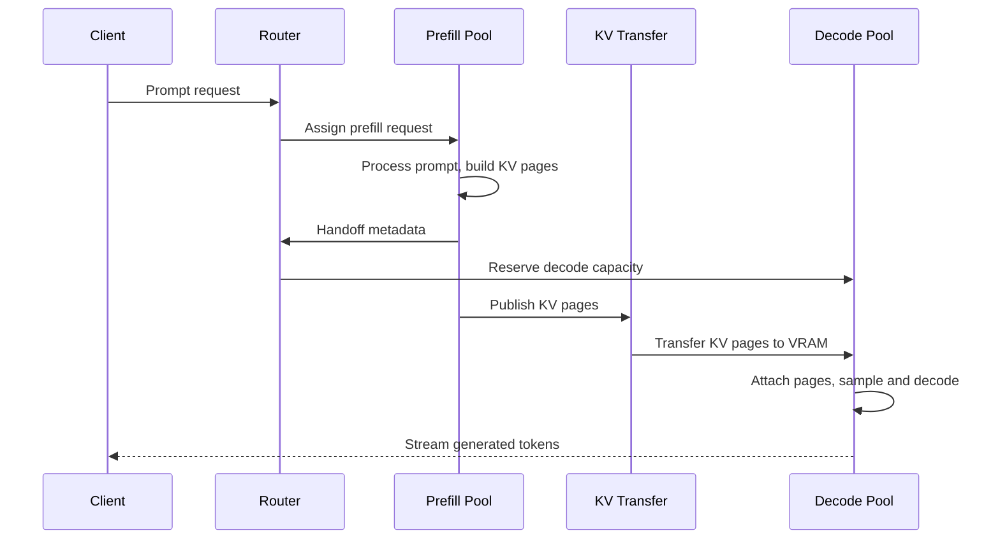

## Disaggregated prefill/decode serving

Disaggregated prefill/decode serving separates the two phases of LLM inference into dedicated GPU pools:

```text
Request
  ↓
Prefill pool: process prompt and build KV cache
  ↓ KV-cache transfer
Decode pool: generate and stream output tokens
  ↓
Client
```

A normal, unified LLM server places both phases on the same GPUs. That is simpler and avoids transferring state, but prefill and decode compete for the same compute and scheduling capacity. A sudden arrival of long prompts can make users who are already receiving generated text wait longer between tokens.

Disaggregation changes the question from “how do we share one GPU pool fairly?” to “how do we specialize two GPU pools and move the model state between them efficiently?”

The state being transferred is not the prompt text alone. It is the prompt’s computed **KV cache**: the internal keys and values from every transformer layer that allow decoding to continue without reprocessing the prompt.

### Why prefill and decode should be separated

Prefill processes all prompt tokens and creates the initial attention state. If a prompt contains P tokens, prefill applies the model over P positions. This phase has substantial parallel work across the prompt and is generally compute-heavy.

Decode then produces tokens autoregressively. Each new token depends on prior tokens, so the next step cannot start until the prior token is generated. Decode has little sequence-level parallelism for a single request and repeatedly reads model weights plus the growing KV cache. It is frequently limited by memory bandwidth rather than arithmetic throughput.

The two phases therefore want different operating points.

| Property | Prefill | Decode |
|---|---|---|
| Input work | Many prompt tokens | Usually one token per sequence per iteration |
| Primary bottleneck | Compute and prompt-attention work | Memory bandwidth and KV-cache reads |
| Important user metric | Time to first token, TTFT | Time per output token, TPOT / ITL |
| Preferred batching | Larger prompt-token batches | Many concurrent active sequences |
| Traffic sensitivity | Long prompts and bursts | Active-session count and output lengths |

In a unified GPU pool, an 8,000-token prefill can share iterations with decode requests through chunked prefill, but it still makes those mixed iterations longer. Under sustained long-context traffic, the scheduler is forced to trade new-request TTFT against existing-user inter-token latency.

With disaggregation, prefill workers handle the large prompt workload while decode workers concentrate on stable, short decode iterations.

### The full lifecycle of one request

A router first accepts the request, authenticates it, applies quota and context-length policy, tokenizes or validates the prompt, and assigns it a stable request ID. It then routes the request to a prefill worker rather than directly to a decoder.

The prefill worker loads the same model architecture and compatible checkpoint as the decode worker. It executes the complete prompt, or its configured prefill chunks, and writes the resulting K and V tensors into its local paged KV-cache pool.

For a decoder-only transformer, each processed token stores keys and values at every layer. A simplified FP16 KV-cache size is:

```text
bytes per token =
    2 × number_of_layers
      × KV_head_count
      × head_dimension
      × bytes_per_element
```

The factor of 2 represents K and V. For a model with 32 layers, 8 KV heads, head dimension 128, and FP16 KV data:

```text
bytes per token =
    2 × 32 × 8 × 128 × 2
  = 131,072 bytes
  = 128 KiB per token
```

For a 4,000-token prompt, the cache for one request is approximately:

```text
4,000 × 128 KiB
= 500 MiB
```

This simplified calculation ignores page metadata, alignment, multiple cache pools, speculative-token handling, and model-specific details, but it shows why KV transfer is a first-class systems problem. A long prompt’s state can be hundreds of megabytes or several gigabytes.

After prefill, the worker has produced:

```text
1. Prompt token IDs and exact tokenization metadata
2. The final prompt logits, from which the first token can be sampled
3. KV-cache pages containing the prompt’s attention state
4. Cache-layout metadata: page/block IDs, token positions, lengths, dtype,
   layer layout, parallelism layout, and ownership/version information
5. A handoff record identifying the source worker and transfer endpoint
```

The router uses this handoff record to choose a decode worker. The decode worker receives or pulls the cache into its own GPU memory, reconstructs the logical sequence from the received pages and metadata, then resumes autoregressive decoding.

The decode worker does **not** recompute the prompt. Its first model step uses the transferred prompt KV cache and the next input token, just as if it had performed prefill locally.

### What “KV transfer” physically means

KV cache is usually paged. A request’s logical sequence might span non-contiguous fixed-size blocks in GPU memory:

```text
Logical token order for request R:
tokens 0–15    → GPU KV block 41
tokens 16–31   → GPU KV block 7
tokens 32–47   → GPU KV block 98
tokens 48–63   → GPU KV block 24
```

The sender cannot merely send “the cache at address X for N bytes” unless its cache is contiguous. It must communicate a page map or a transfer descriptor that identifies the relevant source blocks, their order, byte ranges, dtype, and sequence metadata.

The receiving decode worker allocates compatible destination pages from its own KV pool:

```text
Prefill worker                  Decode worker
──────────────────────────      ──────────────────────────
source block 41  ───────────→   destination block 203
source block 7   ───────────→   destination block 204
source block 98  ───────────→   destination block 205
source block 24  ───────────→   destination block 206
```

The destination page numbers do not need to match the source page numbers. What matters is that the decode worker’s block table maps logical token ranges to the correct received cache pages.

The receiving engine then regards those pages as already computed KV state. Its next attention operation reads them exactly as it would read locally generated cache pages.

### Data path versus control path

A robust system separates the lightweight control plane from the high-volume data path.

```text
Control path:
Router → Prefill worker → Handoff metadata → Router / Decode worker

Data path:
Prefill GPU KV pages → interconnect → Decode GPU KV pages
```

The control path carries request ID, model version, source and destination IDs, prompt length, token IDs or tokenizer fingerprint, page list, transfer handle, checksums, deadlines, and completion status.

The data path carries the actual KV tensors. It should avoid serializing tensors into JSON, copying them through the CPU unnecessarily, or using a generic request/response payload for hundreds of megabytes of device state.

Current serving systems commonly use direct device-memory transfer mechanisms through RDMA-capable communication layers or fast local interconnects. TensorRT-LLM documents direct device-memory transmission for minimizing cache-transfer latency and can overlap cache transfer with other computation. :chatgpt-content-reference{index="0"} NVIDIA’s NIXL library provides a unified inference-oriented transfer interface across GPU memory, CPU memory, and storage tiers, including this prefill-to-decode use case. :chatgpt-content-reference{index="1"}

### Interconnect choices

The transfer path determines whether disaggregation helps or harms.

Within one machine, GPUs may communicate using high-bandwidth paths such as NVLink or PCIe peer-to-peer access. Across machines, GPUDirect RDMA-capable networking can move data between GPU memories while bypassing much of the CPU-mediated copy path.

A conceptual comparison is:

```text
Best path:
Prefill GPU → RDMA/NVLink → Decode GPU

Less efficient path:
Prefill GPU → host RAM → network → host RAM → Decode GPU
```

The second path adds staging copies, CPU/memory-bus pressure, network protocol overhead, and greater tail latency. It can still be useful when no direct GPU path exists, but it reduces the workload range where disaggregation is beneficial.

A rough transfer-time lower bound is:

```text
transfer time ≈ KV bytes / effective transfer bandwidth
```

If a prompt produces 500 MiB of KV state and the effective path provides 50 GB/s:

```text
transfer time ≈ 0.5 GB / 50 GB/s
              = 0.01 seconds
              = 10 ms
```

At 10 GB/s effective bandwidth, the same transfer has a 50 ms lower-bound data-movement cost, before coordination overhead. For long prompts, that may still be preferable to blocking decode work on a shared GPU. For short prompts, it may be pure overhead.

### Why both pools still require model weights

Disaggregation does not divide one model’s layers between the two pools. Both prefill and decode workers must execute the full model, so both normally load the model weights.

```text
Prefill pool: model weights + prompt-oriented compute workspace + KV pool
Decode pool:  model weights + decode-oriented workspace + KV pool
```

The architecture trades weight replication and cache-transfer complexity for independent scaling and better phase isolation.

This means disaggregation is usually justified at meaningful scale. If one GPU or one node can handle the workload comfortably, a unified continuously batched engine is simpler, cheaper, and often faster because no state crosses devices.

### Capacity planning becomes two-dimensional

A unified system scales according to one shared queue and one GPU pool. A disaggregated system has two independent bottlenecks.

```text
Prefill capacity:
prefill tokens processed per second

Decode capacity:
active decode sequences × output tokens per second

Transfer capacity:
KV bytes transferred per second
```

For a workload with request rate `R`, average prompt length `P`, average generated length `G`, and per-input-token KV size `K`, the system must approximately sustain:

```text
Prefill demand = R × P prompt tokens per second

Decode demand = R × G generated tokens per second

KV-transfer demand = R × P × K bytes per second
```

The design is stable only if all three demands remain below their respective usable capacities.

A prefill pool can be saturated even while decode GPUs are underutilized during a long-prompt burst. Conversely, a workload with short prompts and long generations can make decode the bottleneck while prefill GPUs sit idle. The router must observe both pools rather than route only by request count.

### The scheduling pipeline

A production request flow often looks like this:



In many implementations, the router reserves decode capacity before asking prefill to transfer. This prevents a completed prefill from occupying valuable source KV memory while waiting for an unavailable decode destination.

The decode worker should allocate destination cache pages before transfer begins. Otherwise, a prefill worker might finish, transmit data, then discover that the decoder lacks cache capacity. That wastes transfer bandwidth and creates difficult rollback logic.

### Handoff correctness requirements

The prefill and decode workers must agree exactly on how the cache is interpreted. The transfer is invalid if workers differ in model weights, tokenizer behavior, RoPE scaling, KV precision, attention layout, layer count, tensor-parallel degree, head partitioning, block size, or cache format.

A safe handoff record therefore includes at least:

```text
request_id
model revision and tokenizer revision
model/attention/KV-layout fingerprint
KV dtype and quantization metadata
prompt token IDs and prompt length
logical sequence positions
source cache-page descriptors
destination allocation confirmation
transfer ID, checksum, byte count, and deadline
sampling state and first-token status
```

The request ID must remain stable from ingress to final stream. The source and destination workers should use idempotent transfer records so a retried control message does not create duplicate cache ownership or double-start decoding.

vLLM’s disaggregated-prefill implementation explicitly coordinates cache transfer using transfer parameters; its chat-completions flow can reuse token IDs produced by prefill so the decode side skips repeated templating and tokenization. :chatgpt-content-reference{index="2"}

### Transfer modes

The simplest mode is **whole-prompt transfer**. The prefill worker fully processes the prompt, then transfers all its cache pages. TensorRT-LLM documents this whole-prompt handoff model in its KV-transfer guide. :chatgpt-content-reference{index="3"}

```text
Prefill completes
    ↓
Transfer all prompt KV pages
    ↓
Decode begins
```

This is easiest to reason about and validate.

A more advanced mode is **streaming or layer-wise transfer**. As prefill produces cache data, the system begins transferring portions to the decoder. This can overlap communication with remaining computation and reduce end-to-end handoff latency.

```text
Prefill computes early pages/layers
    ↓
Transfer begins
    ↓
Prefill continues later pages/layers
    ↓
Decoder waits only for the dependency frontier it needs
```

This is more difficult because attention layers and the decode worker have ordering dependencies. The system needs precise readiness tracking and must ensure a decoder never reads a page that is partially written or associated with the wrong request generation.

A third pattern is **remote or shared KV access**, where a decode worker accesses cache state held remotely rather than fully copying it. This can reduce copying in some configurations but makes decode latency dependent on remote access and network reliability. It is generally less attractive for the high-frequency reads required by decode unless the interconnect and cache design are specifically optimized for it.

### Overlapping transfer and compute

The transfer itself should be asynchronous. Prefill worker P can compute request B while the KV cache for request A is traveling to decode worker D. Meanwhile D can decode an earlier request Z.

```text
Time →
Prefill GPU:  prefill A ── prefill B ── prefill C
Transfer:              transfer A ── transfer B
Decode GPU:   decode Z ───── decode A ───── decode B
```

This pipeline overlap is where disaggregation gains throughput. If the system performs every step serially:

```text
prefill A → transfer A → decode A → prefill B → transfer B → decode B
```

it wastes specialized hardware and gains little.

TensorRT-LLM explicitly supports overlapping KV-cache transmission with computation for independent requests in disaggregated serving. :chatgpt-content-reference{index="4"}

### Backpressure and queueing

Disaggregation introduces a new intermediate state:

```text
WAITING_PREFILL
→ PREFILL_RUNNING
→ KV_READY
→ TRANSFERRING
→ WAITING_DECODE_CAPACITY
→ DECODE_RUNNING
→ FINISHED
```

A prefill worker must not endlessly produce KV state if decoders are saturated. Otherwise, source KV pools fill with completed-but-undelivered prompts, starving new prefill work.

The router should apply backpressure when any of the following are constrained:

```text
Prefill queue depth
Prefill KV-cache free blocks
Transfer fabric bandwidth or outstanding transfer count
Decode queue depth
Decode KV-cache free blocks
Decode active-sequence capacity
End-to-end latency budget
```

A practical admission rule is:

```text
Admit to prefill only if:
  prefill capacity is available
  and a decode destination can be reserved or is predictably available
  and transfer backlog remains below a configured threshold
```

This avoids turning the prefill pool into an expensive unbounded KV-cache staging area.

### Failure handling

The source cache is temporary. A decode worker may fail after prefill but before or during transfer. A transfer may partially complete. The router may retry a control message while the original transfer is still in flight.

A production system needs explicit ownership and lifecycle rules:

```text
1. Prefill owns source KV pages while producing them.
2. Decode reserves destination pages before transfer.
3. Transfer completion is acknowledged only after validation.
4. Decode owns destination pages after successful attachment.
5. Source pages are released only after decode acknowledgement or expiry.
6. On timeout, the router either retries transfer, reruns prefill, or fails safely.
```

The cache pages themselves are not durable state. If a prefill worker fails before successful transfer, the system normally recomputes prefill from the original prompt. If the decode worker fails after handoff, it may need to retrieve the cache again from a still-live source or recompute from the prompt.

Use request-scoped deadlines, idempotency keys, CRC/checksum validation where transport does not already guarantee integrity, bounded retry budgets, and cleanup leases for orphaned source and destination allocations.

### Security and tenant isolation

KV cache contains model-derived representations of user prompts and conversation context. Treat it as sensitive data.

Transfers should use authenticated worker identities, mutually authenticated encrypted transport when the interconnect does not provide an equivalent protected environment, network segmentation, and short-lived transfer credentials. The router must bind every transfer capability to a single request, model version, worker pair, and expiry time.

Never allow a decoder to attach arbitrary remote pages based only on a user-controlled request ID. The cache manager must validate ownership, model-layout compatibility, tenant/request identity, and page lifetime. Logs should record sizes, timings, worker IDs, cache utilization, and error classes, but should avoid storing prompt text or raw KV data.

### When it is worth using

Disaggregation is strongest when prompt lengths are highly variable, long-context prompts arrive in bursts, decode latency has strict service-level objectives, and the cluster has fast GPU-to-GPU connectivity.

It is often not worthwhile for low-volume deployments, short prompts, short generations, weak interconnects, or workloads where simple unified continuous batching already keeps GPUs efficiently utilized. In those cases, KV transfer and duplicated weights can cost more than the scheduling interference they eliminate.

The practical decision is empirical. Compare unified and disaggregated deployments using the same model, traffic trace, SLOs, and hardware. Measure TTFT, TPOT, P95/P99 latency, output-token goodput, GPU utilization, KV-transfer latency, KV bytes per request, transfer-failure rate, prefill/decode queue depths, and cache pressure.

**Disaggregated serving is a pipeline architecture.** The prefill pool specializes in rapidly reading prompts and creating cache state. The decode pool specializes in stable token-by-token generation. The KV-transfer layer carries the exact attention state across that boundary. Its success depends less on the conceptual split than on fast device-memory transfer, strict cache-format compatibility, coordinated capacity reservation, effective backpressure, and reliable request-state ownership.
